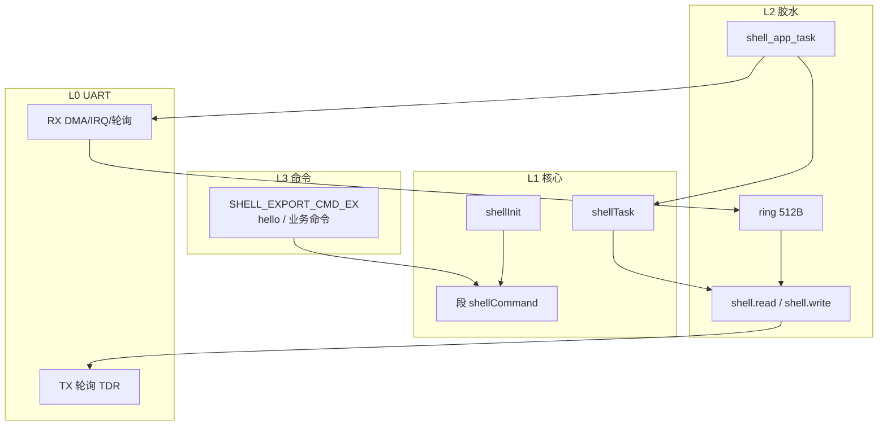

# 01 — 架构与模块说明

## 1. 分层

自下而上 4 层。移植时 **L0 按目标板重做，L1 原样拷贝，L2 用胶水草稿改，L3 目标工程自己加命令**。

| 层 | 名字 | 本包位置 | 职责 |
|----|------|----------|------|
| L0 | UART 硬件 | 目标 `Core/` + 目标 UART 驱动 | 收字节、发字节。教具用 UART4 DMA+IDLE，目标不必相同 |
| L1 | letter-shell 核心 | `src/shell.*` `shell_cfg.h` `shell_ext.*` `ring.*` | 解析行、历史、Tab、命令表、打印 |
| L2 | 板级胶水 | `glue/shell_app.*` | `read`/`write` 函数、ring、FreeRTOS 任务、把 RX 字节喂进 ring |
| L3 | 命令 | `SHELL_EXPORT_CMD_EX` 写在任意已编译的 `.c` | 业务。教具例子在 `examples/本工程_shell_app.c`，不要整份搬 UAV 命令 |

## 2. 运行时序（本教具，目标应对齐这个形状）

1. 系统起 FreeRTOS 后，某个启动任务 `xTaskCreate(shell_app_task, ..., 512, ...)`  
2. `shell_app_task`：开 UART RX → `ring_init` → 填 `shell.read`/`shell.write` → `shellInit(&shell)`  
3. `shellInit` 打印 ASCII 横幅 + 提示符（本教具提示符为 `"\r\nXV>>"`，改 `SHELL_DEFAULT_COMMAND`）  
4. 死循环：若有新 RX 数据则写入 ring → `shellTask(&shell)` → delay 10 ms  
5. `shellTask`（`SHELL_TASK_WHILE==0`）从 `read` 取到 1 字节就 `shellHandler`，取不到立刻返回  

## 3. 核心对象

| 符号 | 文件 | 说明 |
|------|------|------|
| `SHELL_TypeDef shell` | 胶水 | 全局 shell 对象，必须静态/全局，勿做任务栈上的大结构 |
| `uart_rx_ring` + `ring_buf[512]` | 胶水 | 单字节队列；满时 `ring_push` 失败丢字节 |
| `shellCommand` 段 | `SHELL_EXPORT_*` 宏 | 所有命令描述符连续存放；`shellInit` 用 `$$Base/$$Limit` 或 GNU 起止符号计算个数 |

## 4. 本教具 `shell_cfg.h` 要点

完整文件在 `src/shell_cfg.h`。移植时**先原样用**，确认 `help` 通了再改提示符/长度。

| 宏 | 值 | 移植注意 |
|----|-----|----------|
| `SHELL_COMMAND_MAX_LENGTH` | 50 | 一行最长 |
| `SHELL_PARAMETER_MAX_NUMBER` | 8 | 含命令名最多 8 段 |
| `SHELL_HISTORY_MAX_NUMBER` | 5 | 上/下键历史 |
| `SHELL_PRINT_BUFFER` | 128 | `shellPrint` 格式化缓冲；0 则关掉格式化打印 |
| `SHELL_GET_TICK()` | `0` | 双击 Tab 出长 help 的时间戳；要该功能改为 `HAL_GetTick()` |
| `SHELL_DOUBLE_CLICK_TIME` | 200 | 仅 `SHELL_GET_TICK()` 有效时有意义 |
| `SHELL_MAX_NUMBER` | 5 | 同时存在的 shell 实例上限 |
| `SHELL_LONG_HELP` | 1 | `SHELL_EXPORT_CMD_EX` 的第四参 |

## 5. ring

`src/ring.c` 是环形队列，**空出一个槽表示满**。  
`ring_poll` 成功返回 `0`（注意：与常见「0=失败」相反）。胶水里 `myShellRead` 正是按「0=读到字节」接到 `shellTask` 的。

## 6. `shell_ext`

仅当 `SHELL_AUTO_PRASE==1` 时 `shell.c` 才会 `#include "shell_ext.h"`。  
本配置为 0，**仍建议把 `shell_ext.c` 编进工程**（与教具 Keil 组一致，避免以后误开宏缺文件）。不要启用自动解析，见 `00` §2.3。
