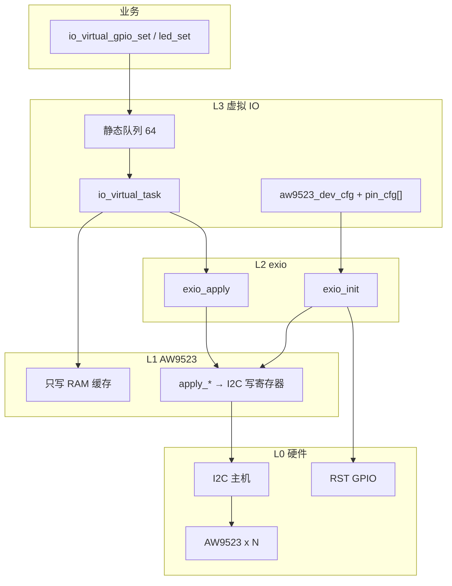

# 01 — 架构与模块说明

## 1. 分层

自下而上 4 层。移植时 **L0 由用户 CubeMX 配，L1/L2 原样拷贝，L3 用胶水草稿改脚表，业务自己调 API**。

| 层 | 名字 | 本包位置 | 职责 |
|----|------|----------|------|
| L0 | I2C + RST GPIO | 目标 `Core/` | I2C 主机、RST 推挽输出。教具用 I2C2+PC7，目标不必相同 |
| L1 | AW9523 驱动 | `src/aw9523.*` | 缓存模式/电平/LED 亮度；`apply_config` / `apply_output` 才上 I2C |
| L2 | exio 封装 | `src/exio.*` | 把 GPIO/LED 配置表刷进 aw9523 缓存并 init/apply |
| L3 | 虚拟 IO | `glue/io_virtual.*` | 逻辑编号、命令队列、`io_virtual_task` |
| 板级宏 | port | `src/aw9523_port.h` | RST 翻转宏、可选日志 |

## 2. 运行时序（本教具，目标应对齐这个形状）

1. CubeMX 已 `MX_I2Cx_Init()`，RST 脚已配成推挽输出
2. 某个启动任务 `xTaskCreate(io_virtual_task, "io_virtual", 2048, NULL, osPriorityNormal, NULL)`
3. `io_virtual_task`：建静态队列 → `SuspendAll` 下拷贝配置表并 `exio_init` → `ResumeAll`
4. `exio_init`：`aw9523_init`（RST 脉冲 + 全部脚先当 LED/灭）→ 按表 `set_pin_mode` / 默认值 → **先** `apply_output` **再** `apply_config`
5. 死循环：`xQueueReceive` 阻塞 → 尽量排空队列 → 有变更则 `exio_apply`（只刷输出寄存器，不再改模式）

## 3. 核心对象

| 符号 | 文件 | 说明 |
|------|------|------|
| `exio_t` | `exio.h` | 内含 `aw9523_dev` + GPIO/LED 各 64 槽。体积约数 KB，**必须静态/全局**，勿放任务栈 |
| `aw9523_dev` | `aw9523.h` | `hi2c`、RST 脚、`chip_num`（1~4）、每片 `a0/a1` |
| `s_vio_cmd_q` | 胶水 | 静态队列；投递超时默认 20 ms |
| `vio_gpio_id_t` / `vio_led_id_t` | 胶水头 | 逻辑编号；**下标 = cfg 数组下标** |

## 4. AW9523 驱动要点（移植时先原样用）

| 项 | 值 / 行为 |
|----|-----------|
| 8 位写地址基址 | `0xB0` |
| `a0==1` | 地址或上 `0x02` |
| `a1==1` | 地址或上 `0x04` |
| I2C | `HAL_I2C_Master_Transmit`，超时 10 ms；HAL 用**8 位地址**（7 位左移后的值） |
| `set_pin_*` | **只写缓存**，不上总线 |
| `apply_config` | 写方向 + LED/GPIO 模式切换 |
| `apply_output` | 写 OUTPUT + 16 字节 DIM |
| 输入模式 | **未实现**，`AW9523_PIN_MODE_IN` 直接 `HAL_ERROR` |
| DIM 映射 | **乱序**，见 `05`；禁止按脚号自己填 `0x20+n` |

`ledmode_isel`：0=Imax、1=3/4、2=2/4、3=1/4。  
**坑：** `aw9523_init` 仅在 `ledmode_isel != 0` 时写 GCR（含 P0 推挽位）。Bring-up 请用 **1~3**，不要用 0。

RST：驱动里低电平后立刻拉高，没有软件延时。若目标板 init 失败，可在 `aw9523_port.h` 的宏里自行加短延时（改宏，尽量别改 `aw9523.c`）。

## 5. 实时性

虚拟 IO = I2C + 任务队列，延迟可达数毫秒级，且会合并多次命令再一次 `apply`。  
**禁止**用来做电调 PWM、舵机 PWM、编码器、高频方波。那些走 TIM / 直接 MCU GPIO。
